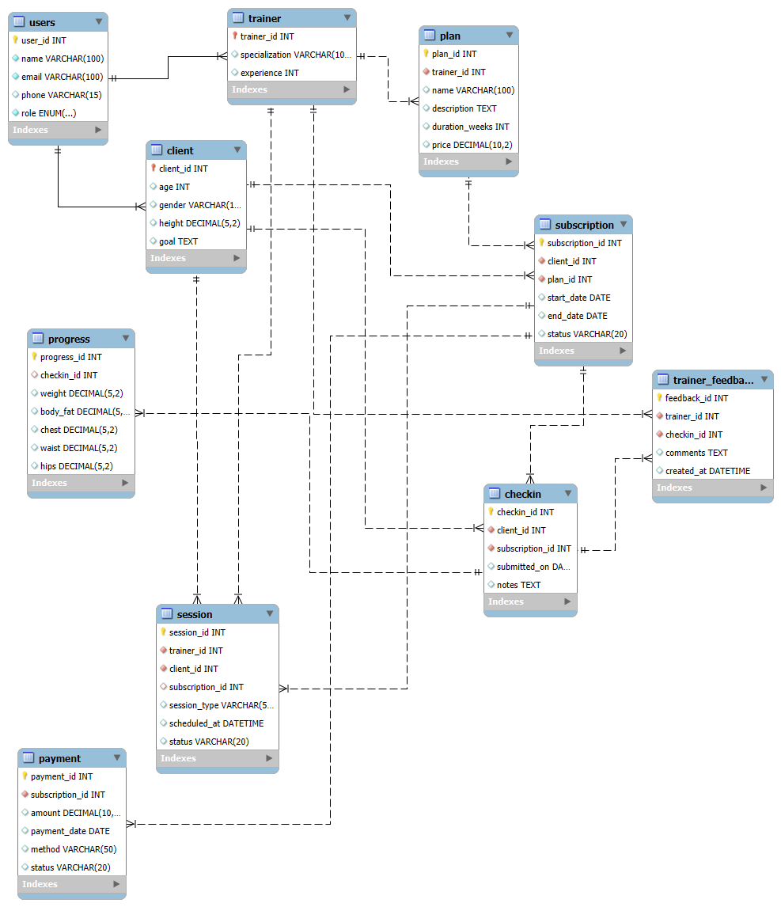

Fitness App Database Schema

This database supports a fitness platform connecting trainers and clients, managing plans, subscriptions, sessions, progress tracking, feedback, and payments.

Tables
User – Stores common user info (name, email, phone, role = trainer or client).
Trainer – Trainer-specific info (specialization, experience).
Client – Client-specific info (age, gender, height, goal).
Plan – Fitness plans created by trainers (name, description, duration_weeks, price).
Subscription – Client subscriptions to plans (start_date, end_date, status).
Session – Scheduled sessions between trainers and clients (session_type, scheduled_at, status).
CheckIn – Client check-ins for progress tracking (submitted_on, notes).
Progress – Metrics for each check-in (weight, body_fat, chest, waist, hips).
Trainer_Feedback – Feedback from trainers on check-ins (comments, created_at).
Payment – Payment records for subscriptions (amount, payment_date, method, status).
Relationships
User → Trainer / Client: One-to-one
Trainer → Plan: One-to-many
Client → Subscription → Plan: Many-to-one
Subscription → Session / CheckIn / Payment: One-to-many
CheckIn → Progress / Trainer_Feedback: One-to-one (or many feedbacks per check-in)

