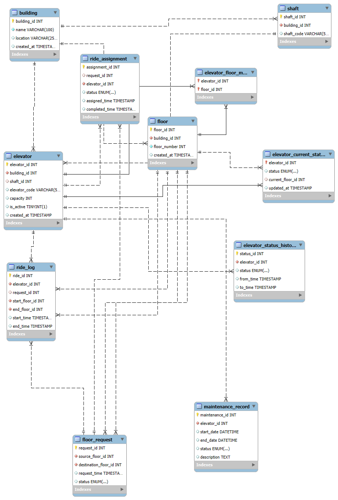

This ER diagram models a smart elevator system for multi-building environments, supporting ride requests, elevator allocation, status tracking, and maintenance management.

Core Entities
Building → contains floors and elevators
Floor → belongs to a building
Elevator → operates within a building
Shaft → optional physical grouping of elevators
Elevator_Floor_Map → many-to-many mapping between elevators and floors

Operations
Floor_Request → user ride requests (source & destination)
Ride_Assignment → assigns requests to elevators
Ride_Log → stores completed ride history

Monitoring & Maintenance
Elevator_Current_Status → real-time status
Elevator_Status_History → past status tracking
Maintenance_Record → maintenance lifecycle

Key Relationships
Building → Floors (1)
Building → Elevators (1)
Elevators ↔ Floors (M)
Request → Assignment → Elevator
Elevator → Ride Logs / Maintenance

System Flow
User generates a Floor_Request (source → destination)
System creates a request with status PENDING
Request is assigned to an optimal Elevator via Ride_Assignment
Elevator moves and updates Current Status
Ride details are stored in Ride_Log after completion
Status changes are recorded in Elevator_Status_History
Maintenance events are tracked separately in Maintenance_Record

